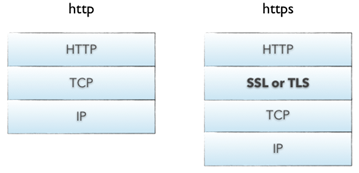
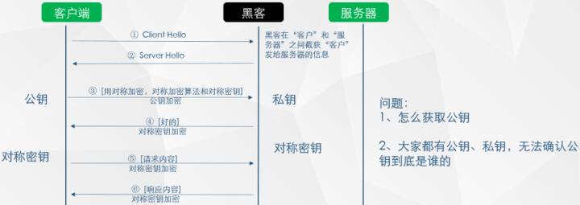

# HTTPS

HTTP协议属于明文传输协议，交互过程以及数据传输都没有进行加密，通信双方也没有进行任何认证，通信过程非常容易遭到劫持、监听、篡改、流量劫持和个人隐私泄露等问题。

比如常见的，在HTTP通信过程中，"中间人"将广告链接嵌入HTTP响应报文中，导致用户界面出现了很多不良的链接；或者是修改用户的请求报文，导致用户的请求被劫持到其他网站。


## 安全的HTTPS

- SSL：Secure Socket Layer，安全套接字层
- TLS：Transport Layer Security，安全传输层，前身是SSL，目前广泛使用的TLS 1.1和TLS 1.2




要解决HTTP不安全的问题，需要从两个方面入手：

- 消息加密，如果服务器给客户端的消息是密文的，只有服务器和客户端才能读懂，就可以保证数据的保密性；
- 身份验证机制，在数据交换之前，验证对方的合法身份，就可以保证通信双方的安全。

### 公钥密码体制

公钥密码体制包括三部分：公钥、私钥和加密解密算法。

- 加密：通过加密算法和公钥对明文进行加密，得到密文。
- 解密：通过解密算法和私钥对密文进行解密，得到明文。

注意：由公钥加密的内容只能由私钥进行解密，如果不知道私钥，是无法解密的。


### 对称加密算法

在对称加密算法中，加密使用的秘钥和解密的秘钥是一样的，使用的是同一个秘钥。与公钥密码体制不同，在对称加密算法中不区分公钥和私钥。

**秘钥：**一般就是一个字符串或数字，在加密或者解密时传递给加密/解密算法。前面提到的公钥是加密使用的秘钥，私钥是解密使用的秘钥。

### 非对称加密算法

在非对称加密算法中，加密使用的秘钥和解密使用的秘钥是不同的。


### 劫持秘钥



- 中间人在收到服务器发送给客户端的公钥并保存，然后发送一个伪造公钥给客户端；
- 客户端使用伪造公钥进行加密后，将其发送给中间人；
- 中间人利用自己的私钥进行数据解密后，使用正确的公钥加密数据后，发送给服务器；
- 中间人最后把服务器的响应发送给客户端。

此时，客户端和中间人，中间人和服务器都有了一样的对称秘钥，后续客户端和服务器的所有加密数据，中间人都可以通过对称秘钥来破解。

### RSA

RSA是一种公钥密码体制，公钥和加密算法公开、私钥保密。由公钥加密的内容可以并且只能由私钥进行解密，同样地，由私钥加密的内容可以并且只能由公钥进行解密。

RSA算法加密速度很快但是解密速度很慢

其他的类似算法有：DSA算法，加密速度慢和验证速度很慢，但是解密速度很快。DSA可能会泄露私钥，建议不使用。

### 签名

签名就是在信息的后面加上一段内容，证明信息没有被修改过。一般是对信息做一个不可逆的hash计算，然后把hash值加密后作为一个签名和信息一起发送出去。

为了防止信息和签名均被恶意修改，hash值一般会加密后作为签名，再和信息一起发送，以保证hash值不会被修改。至于如何解密这个签名，涉及到数字证书的概念。


### 数字证书


### HTTPS通信过程

利用数字证书、RSA公钥密码体制、对称加密算法以及签名完成一个HTTPS通信过程：

```
step1: “客户”向服务器发送一个通信请求
“客户”->“服务器”：你好

step2: “服务器”向客户端发送自己的数字证书。
	证书中有一个公钥用来加密信息，私钥是“服务器”私有的
“服务器”->“客户”：你好，我是服务器，请查收我的数字证书

step3: “客户”收到”服务器“的数字证书后，检查证书是否确实为“服务器”所有。
	验证通过之后，“客户”会发送一个随机字符串给“服务器”，“服务器”用私密将其加密之后返回给“客户”，“客户”用公钥解密这个返回结果。
	如果解密结果与之前生成的随机字符串一致，那么就可以证明对方确实是私钥的持有者，即“服务器”。
“客户”->“服务器”：向我证明你就是服务器，这是一个“随机字符串”
“服务器”->“客户”：{加密的随机字符串}[私钥|RSA算法]

step4: “客户”确认完“服务器”的身份后，“客户”生成一个对称加密算法和密钥发送给“服务器”。
	这个对称加密算法和密钥由客户通过RSA的公钥进行加密，只有“服务器”持有的私钥可以解密，所以即使被中间人截获也无关紧要。
“客户”->“服务器”：{这是之后的对称加密算法和密钥}[密钥|RSA]
“服务器”->“客户”：{收到}[密钥|对称加密算法]

step5: 完成身份验证之后，之后的通信明文使用对称加密算法进行加密，并且通过签名的方式确认信息没有被修改。
... // 正常的通信过程
```


## 总结

 相比于HTTP协议，HTTPS协议增加了更多的握手，加密解密的过程，过程更加复杂，但是可以保证数据传输的安全。
 
 - 所有的数据都是加密的，无法被黑客窃取
 - 配备身份证书，防止身份被冒充
 - 具有校验机制，通信双方都会发现被篡改的数据


## 参考文章
 
 - [Franson](https://www.cnblogs.com/franson-2016/p/5530671.html#4189579)
 
 - [又拍云](https://zhuanlan.zhihu.com/p/27395037)